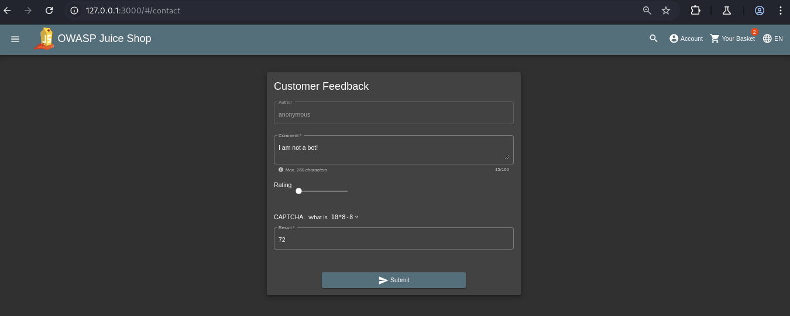
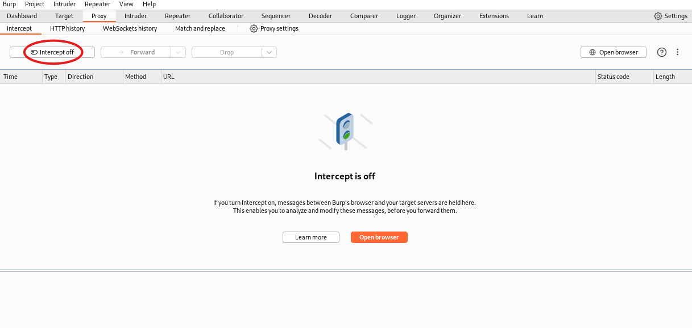
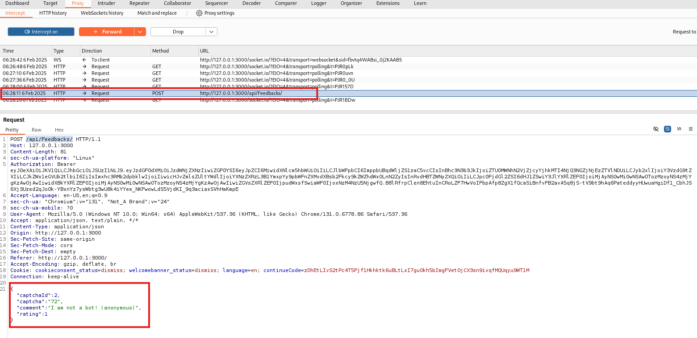
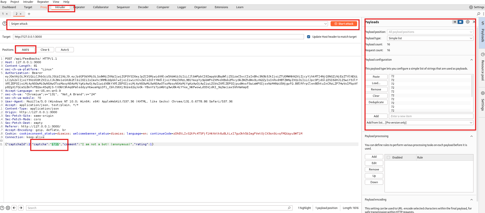
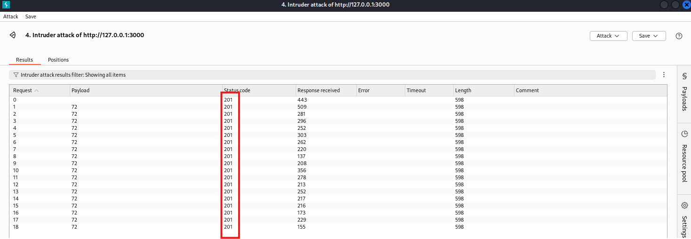

# **OWASP Juice Shop - CAPTCHA Bypass Challenge**

## **Link to Video (german):**

https://go.screenpal.com/watch/cTn1IlnheGB

**Disclaimer:** The OWASP Juice Shop is deployed on my local machine for testing purposes.

---

## **Table of Contents**

1. [Challenge Description](#1-challenge-description)
2. [Procedure](#2-procedure)
3. [Solution & Explanation](#3-solution--explanation)
4. [Countermeasures](#4-countermeasures)
5. [Disclaimer](#5-disclaimer)

---

## **1. Challenge Description**

- **Name:** CAPTCHA Bypass
- **Category:** Broken Anti-Automation
- **Difficulty:** ☆☆☆☆☆ (3 Stars)
- **Objective:** Submit 10 or more customer feedback entries within 20 seconds.
- **Hint (Juice Shop):** After finding a CAPTCHA bypass, write a script that automates feedback submission. Alternatively, open multiple browser tabs and submit quickly.
- **Hint (Developer Akademie):** Use Burp Suite Intruder or write a small Python script to automate the process.

### **What is Broken Anti-Automation?**

Broken Anti-Automation is a security vulnerability that occurs when a web application lacks proper measures to prevent automated attacks, such as bots or script-based abuse. This can lead to issues like brute-force attacks, credential stuffing, spam, or denial-of-service (DoS). Common protections against automation include CAPTCHAs, rate limiting, and behavioral analysis, but if these are missing or poorly implemented, attackers can exploit the system with automated tools.

---

## **2. Procedure**

### **Starting Point:**

The challenge is based on the **customer feedback form**, accessible at:  
 [http://127.0.0.1:3000/#/contact](http://127.0.0.1:3000/#/contact)

### **Tools Used:**

**Burp Suite (Intruder & Proxy)**  
**Python (optional alternative method)**

This guide demonstrates the Burp Suite Intruder approach.

---

## **3. Solution & Explanation**

### **Step 1: Submit a Customer Feedback Entry**

First, we create a dummy feedback entry in the **customer feedback form**.



### **Step 2: Capture the Request with Burp Suite**

- Enable the **Burp Suite Proxy** and turn on **Intercept**.
- Submit the customer feedback form on the `/contact` page.

  


### **Step 3: Analyze the Request**

- After submission, Burp Suite captures a **POST request** to:  
   `http://127.0.0.1:3000/api/Feedbacks/`
- In the **request body**, we see that the CAPTCHA consists of an **ID** and its **solution**:

```json
{
    "captchaId": 2,
    "captcha": "72",
    ...
}
```

This means that the CAPTCHA is validated on the client-side and not properly secured server-side.



### **Step 4: Automate the Submission via Burp Suite Intruder**

- Send the captured **POST request** to **Burp Suite Intruder**.
- Configure the **captcha solution ("72")** as a static payload.
- Generate at least **10 identical requests**.
- Start a **Sniper Attack** with Burp Suite.



### **Step 5: Verify Successful Exploitation**

- The server accepts all requests and returns HTTP **201 Created** responses.
- The Juice Shop challenge confirms success with a notification and confetti animation.



**We have successfully bypassed the CAPTCHA and submitted more than 10 feedback entries in under 20 seconds. This demonstrates a vulnerability where the CAPTCHA protection can be easily circumvented.**

---

## **4. Countermeasures**

To prevent such **Broken Anti-Automation** vulnerabilities, developers should implement the following security measures:

- **Server-Side CAPTCHA Validation:** Ensure that CAPTCHA verification is done on the **server** instead of relying on client-side validation.

- **Rate Limiting & Throttling:** Limit the number of requests per IP/user within a time frame to **mitigate automated attacks**.

- **Randomized CAPTCHA IDs & Values:** Avoid predictable **captchaId** and **captcha values**, making it harder to bypass the protection.

- **Use More Advanced CAPTCHAs:** Implement **Google reCAPTCHA** or **hCaptcha**, which are harder to bypass with automation tools.

- **Monitor and Log Suspicious Activity:** Set up **logging and monitoring** to detect **unusual request patterns** (e.g., multiple submissions in a short time).

---

## **5. Disclaimer**

This project is for **educational and ethical hacking purposes only**. The techniques demonstrated here should **never** be used for illegal activities or unauthorized testing. Always obtain **explicit permission** before testing any system. **Ethical hacking is about improving security, not exploiting it.**

---
