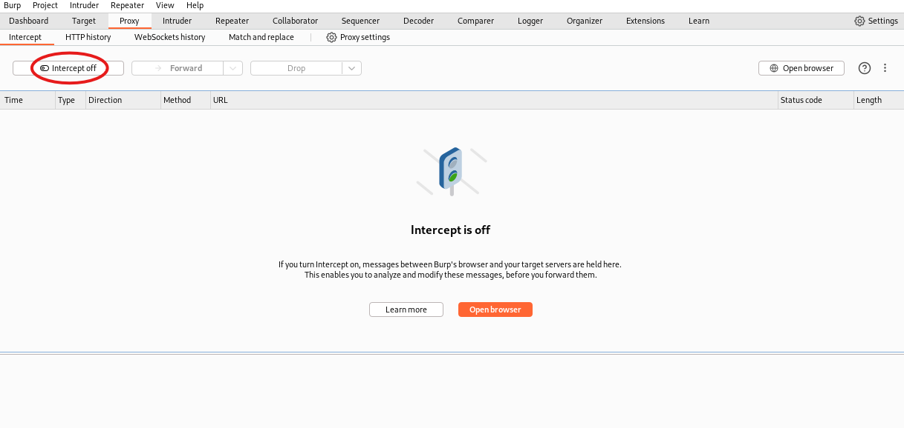

# **OWASP Juice Shop - Client-side XSS Protection Challenge**

## **Link to Video (German):**

https://go.screenpal.com/watch/cTn1ohnhf6A

**Disclaimer:** The OWASP Juice Shop is deployed on my local machine for testing purposes.

---

## **Table of Contents**

1. [Challenge Description](#1-challenge-description)
2. [Procedure](#2-procedure)
3. [Solution & Explanation](#3-solution--explanation)
4. [Countermeasures](#4-countermeasures)
5. [Disclaimer](#5-disclaimer)

---

## **1. Challenge Description**

- **Name:** Client-side XSS Protection
- **Category:** XSS
- **Difficulty:** ☆☆☆☆☆ (3 Stars)
- **Objective:** Perform a persisted XSS attack using `<iframe src="javascript:alert('xss')">` while bypassing a client-side security mechanism.
- **Hint (Juice Shop):** Only some input fields validate their input. Even fewer of these persist their content in a way that displays it on another screen. Click for more hints.

### **What is XSS (Cross-Site Scripting)?**

Cross-Site Scripting (XSS) is a security vulnerability that allows attackers to inject malicious JavaScript into a website. This can lead to session hijacking, data theft, phishing attacks, or defacing web pages. XSS typically occurs when user input is not properly validated or sanitized before being rendered on a webpage.

---

## **2. Procedure**

### **Starting Point:**

The challenge is based on the **register form**, accessible at:  
[http://127.0.0.1:3000/#/register](http://127.0.0.1:3000/#/register)

### **Tools Used:**

- **Burp Suite** (Repeater & Proxy)

---

## **3. Solution & Explanation**

### **Step 1: Submit a Customer Feedback Entry**

First, we create a dummy user entry in the **register form**.  
**Important:** Do not press the "Register" button before step 2.


### **Step 2: Capture the Request with Burp Suite**

- Enable **Burp Suite Proxy** and turn on **Intercept**.
- Submit the register form on the `/register` page.

  


### **Step 3: Analyze the Request**

- After submission, Burp Suite captures a **POST request** to:  
  `http://127.0.0.1:3000/api/Users/`
- In the **request body**, we see that the email field can be manipulated:


```json
{
    "email":"abc@abc",
    ...
}
```

This indicates that the input is not strictly validated on the client side.

### **Step 4: Modify and Send the Request via Repeater**

- Send the captured **POST request** to **Burp Suite Repeater**.
- Modify the `email` field to inject the XSS payload: `<iframe src="javascript:alert('xss')">`  
  _(Note: Escape double quotes `"` inside JSON to avoid syntax errors.)_
- Send the modified request.


### **Step 5: Verify Successful Exploitation**

- The server accepts the manipulated **POST request** and returns an **HTTP 201 Created** response.


- The Juice Shop challenge confirms success with a notification and confetti animation.
- When logged into the **admin account** and navigating to `/administration`, we can observe the XSS execution:


**We have successfully bypassed the client-side XSS protection.**

---

## **4. Countermeasures**

To prevent **XSS** vulnerabilities, developers should implement the following security measures:

### **1. Input Validation & Sanitization**

- **Validate user input** on both **client-side and server-side** to reject potentially dangerous characters.
- **Sanitize inputs** by escaping or removing harmful tags like `<script>`, `<iframe>`, and inline JavaScript execution (`javascript:` URLs).

### **2. Content Security Policy (CSP)**

- Implement **CSP headers** to restrict JavaScript execution to trusted sources:
  ```http
  Content-Security-Policy: default-src 'self'; script-src 'self' https://trusted-cdn.com;
  ```
- This prevents inline scripts and untrusted third-party scripts from executing.

### **3. Use Secure Encoding**

- Encode output using **HTML entity encoding** before rendering user inputs on a webpage:
  ```html
  &lt;script&gt;alert("XSS")&lt;/script&gt;
  ```
  This ensures that user-provided scripts are displayed as text instead of executing.

### **4. Avoid Dangerous JavaScript Functions**

- Do not use `eval()`, `document.write()`, `innerHTML`, or `setTimeout()` with user-controlled inputs.
- Use **safe alternatives** such as `textContent` or `createElement()`.

### **5. Implement HTTP-Only & Secure Cookies**

- Set the `HttpOnly` and `Secure` flags for session cookies to prevent client-side script access:
  ```http
  Set-Cookie: sessionid=xyz; HttpOnly; Secure; SameSite=Strict
  ```

### **6. Server-Side Escaping (Output Encoding)**

- Ensure **server-side frameworks** (like Express.js, Spring, Django) properly encode user inputs before rendering them in HTML.

### **7. Regular Security Audits & Penetration Testing**

- Conduct **regular security reviews** and **automated security testing** (e.g., OWASP ZAP, Burp Suite).
- Implement **CICD security checks** to prevent vulnerabilities from reaching production.

---

## **5. Disclaimer**

This project is for **educational and ethical hacking purposes only**. The techniques demonstrated here should **never** be used for illegal activities or unauthorized testing. Always obtain **explicit permission** before testing any system. **Ethical hacking is about improving security, not exploiting it.**

---
