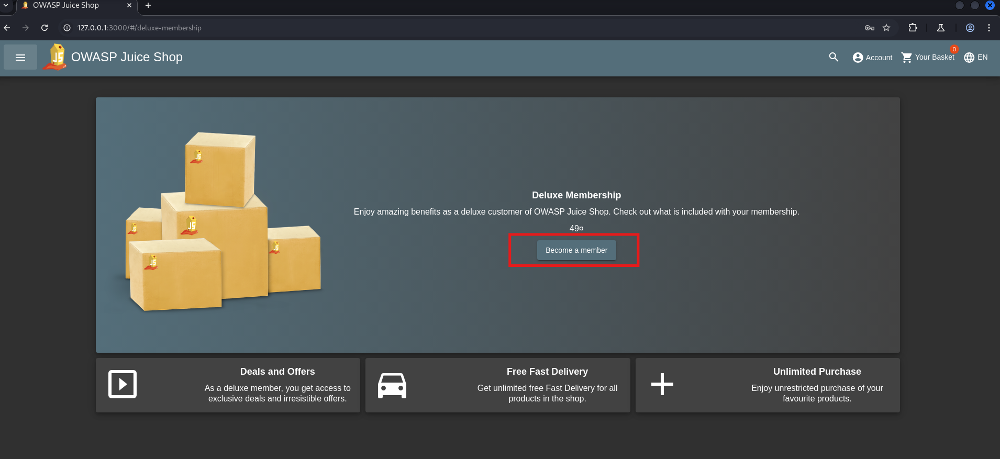
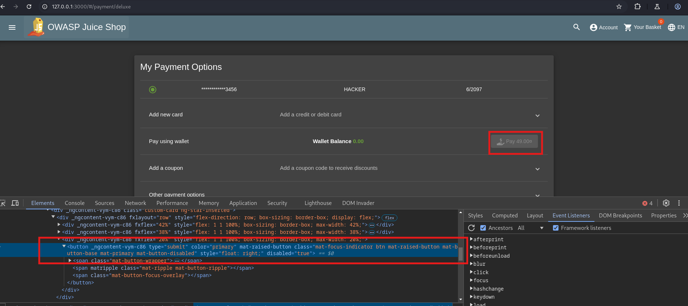
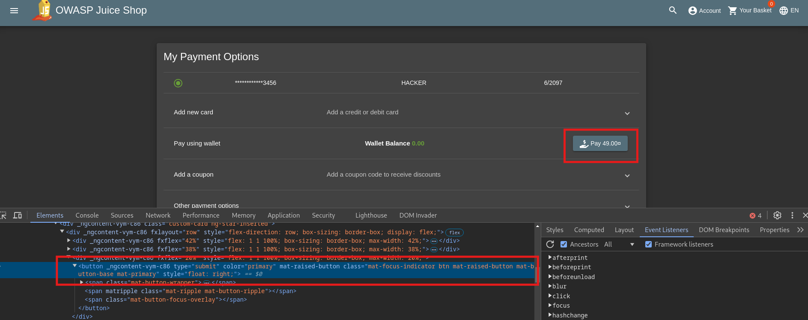
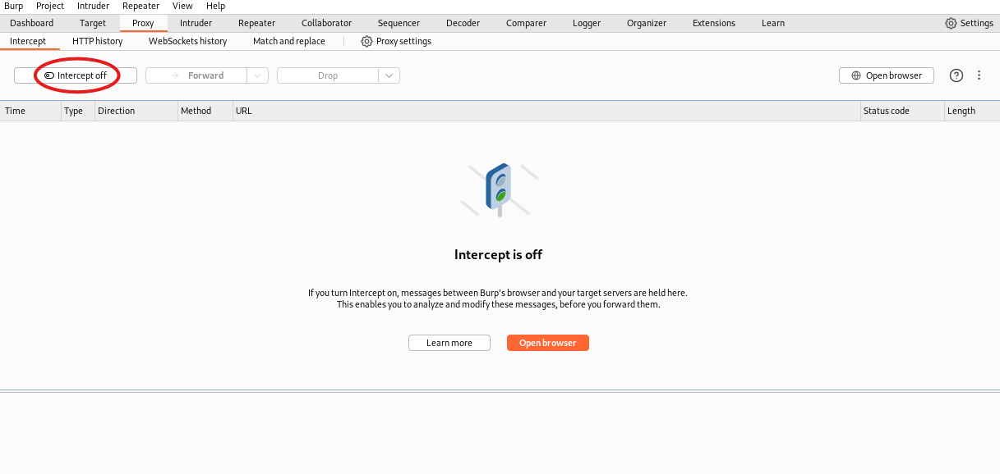
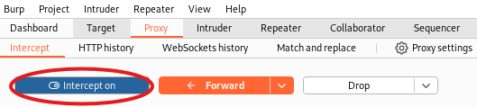
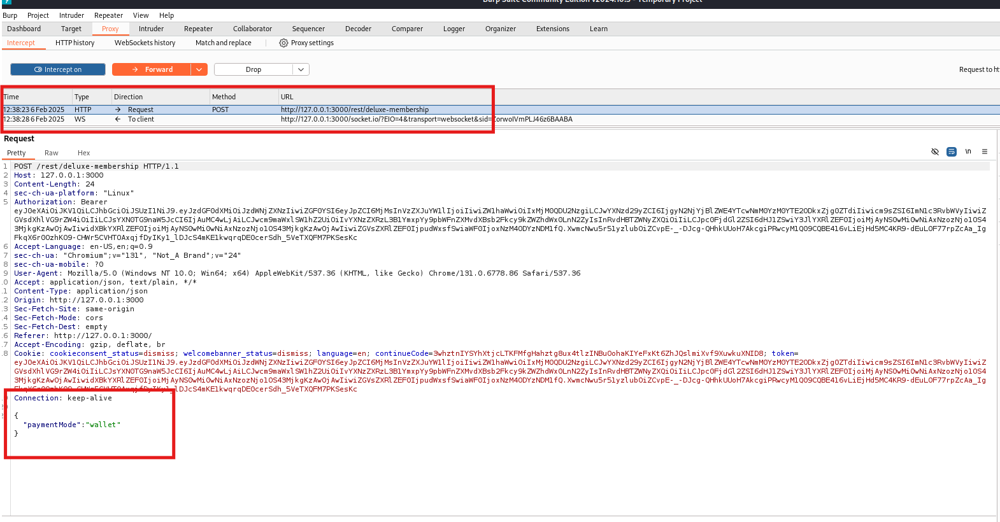
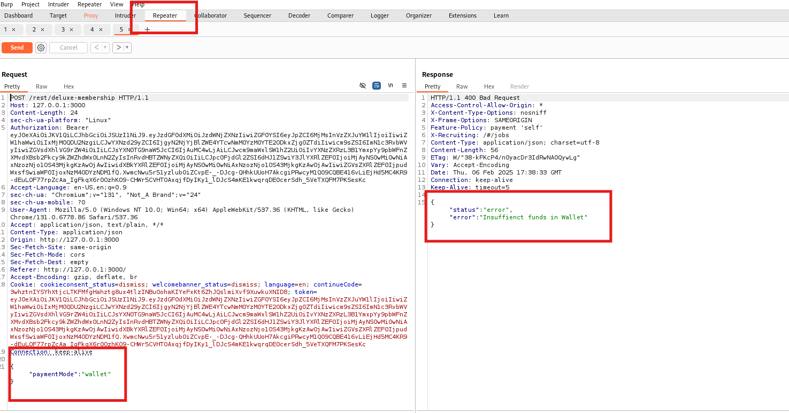
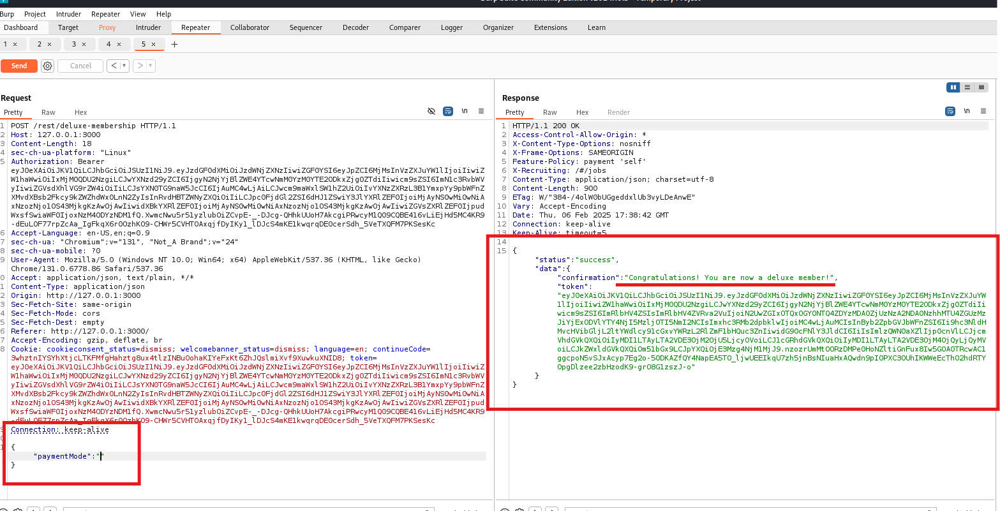

# **OWASP Juice Shop - Deluxe Fraud Challenge**

## **Link to Video (German):**

https://go.screenpal.com/watch/cTn1rqnhhZ6

**Disclaimer:** The OWASP Juice Shop is deployed on my local machine for testing purposes.

---

## **Table of Contents**

1. [Challenge Description](#1-challenge-description)
2. [Procedure](#2-procedure)
3. [Solution & Explanation](#3-solution--explanation)
4. [Countermeasures](#4-countermeasures)
5. [Disclaimer](#5-disclaimer)

---

## **1. Challenge Description**

- **Name:** Deluxe Fraud
- **Category:** Improper Input Validation
- **Difficulty:** ☆☆☆☆☆ (3 Stars)
- **Objective:** Obtain a Deluxe Membership without paying for it.
- **Hint (Juice Shop):** Look closely at what happens when you attempt to upgrade your account. Click for more hints.

### **What is Improper Input Validation?**

Improper Input Validation occurs when an application does not properly verify user-provided input before processing it. This can lead to various security vulnerabilities, including **authentication bypass, privilege escalation, SQL injection, and business logic flaws**. In this challenge, improper validation allows us to bypass a payment check and obtain a **deluxe membership** for free.

---

## **2. Procedure**

### **Starting Point:**

The challenge is based on the **deluxe membership page**, accessible at:  
[http://127.0.0.1:3000/#/deluxe-membership](http://127.0.0.1:3000/#/deluxe-membership)

**Note:** You must be logged into a user account, admin access does not work.

### **Tools Used:**

- **Burp Suite** (Repeater & Proxy)
- **Developer Tools from Burp Suite Browser** (Inspector)

---

## **3. Solution & Explanation**

### **Step 1: Log into a user account and access the "deluxe-membership" page**

- After logging into a user account, go to the `/deluxe-membership` page and click on "Become a member".

### **Step 2: Open DevTools, Modify Button, and Intercept Request**

- Open the Developer Tools in the browser and inspect the **Pay** button element.

- The button has attributes `disabled="true"` and `mat-button-disabled`. Remove these attributes to enable the button.

- The Pay button is now enabled and clickable.  
  **Important:** Do not click the button before enabling Burp Suite's **Interceptor**.

- Enable **Intercept** mode in Burp Suite:

  

- When we intercept the request with Burp Suite, we capture the following:

### **Step 3: Modify and Send the Request via Repeater**

- Send the captured **POST request** to **Burp Suite Repeater**.
- Send the request and analyze the response:

- We receive an error message: **"Insufficient funds in wallet"**.
- What if we remove the `paymentMode` value entirely?

These are the results:

As we can see, **we now have a deluxe membership** simply by bypassing the payment validation. This proves that the application does not correctly validate input before processing transactions.

**We have successfully obtained a deluxe membership through improper input validation.**

---

## **4. Countermeasures**

To prevent **Improper Input Validation** vulnerabilities, developers should implement the following security measures:

### **1. Implement Proper Input Validation**

- Validate **all user inputs** on both the client-side and server-side.
- Use **allowlists** instead of blocklists to define acceptable values.
- Ensure fields such as `paymentMode` cannot be left empty or manipulated.

### **2. Enforce Server-Side Validation**

- Do not rely solely on client-side restrictions like `disabled` attributes, as they can be easily bypassed.
- Implement **strict validation checks** on the server before processing transactions.

### **3. Use Strong Authentication & Session Management**

- Require re-authentication before critical actions like **membership upgrades**.
- Ensure **session tokens** cannot be manipulated to alter privileges.

### **4. Implement Business Logic Validation**

- Ensure that financial transactions **always** require a valid payment method.
- Implement **backend verification** to check account balances before approving upgrades.

### **5. Logging & Monitoring**

- Log **suspicious activities**, such as empty payment requests.
- Implement **intrusion detection** to identify fraudulent activity in real time.

### **6. Regular Security Audits & Penetration Testing**

- Perform regular **code reviews** and **penetration testing** to identify flaws in input validation.
- Use **automated security tools** to detect missing validation logic.

---

## **5. Disclaimer**

This project is for **educational and ethical hacking purposes only**. The techniques demonstrated here should **never** be used for illegal activities or unauthorized testing. Always obtain **explicit permission** before testing any system. **Ethical hacking is about improving security, not exploiting it.**

---
